# Ejercicio 3


## Paso 1 - Configuración de una instancia en Amazon Linux en Amazon AWS
___
___

Lo primero que deberemos considerar es si tenemos una cuenta válida en Amazon AWS, en caso afirmativo, entraremos desde este enlace.

[AWS Educate Login](https://www.awseducate.com/login?startURL=%2FSiteLogin "AWS Educate Login")

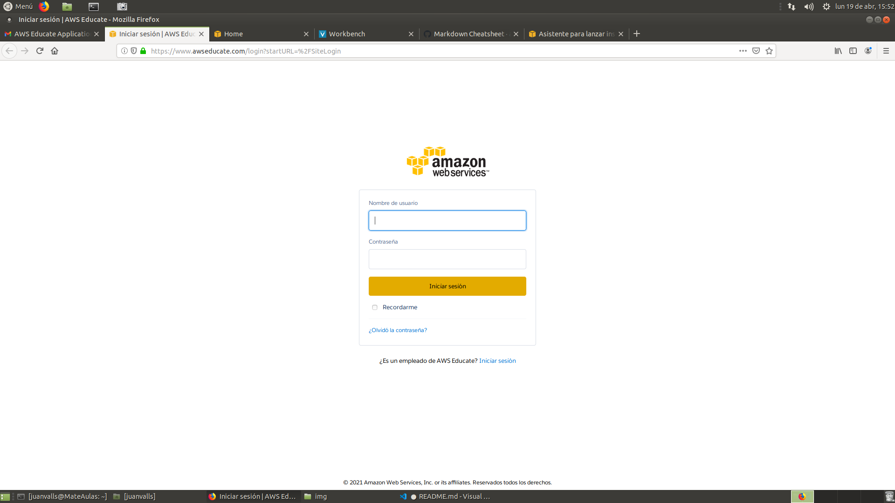

Introducimos nuestro usuario y contraseña y accedemos. 

Esto nos llevará a otra pantalla y deberemos acceder al apartado "AWS Account" ubicado en la barra horizontal del menú de navegación. 

Una vez accedamos aquí entraremos a la consola, y después al apartado "EC2". 

Deberíamos ver algo así.

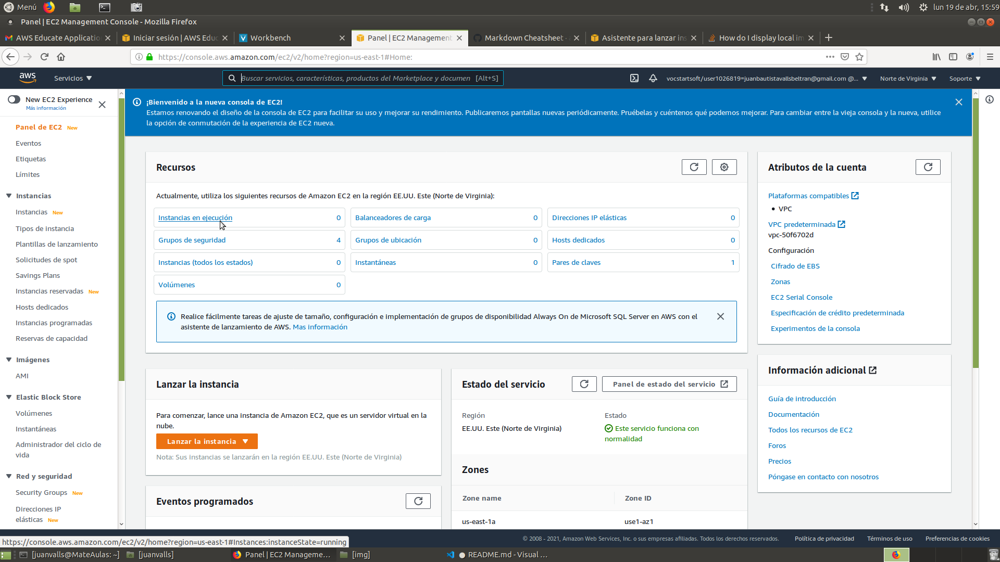

Por ahora no tenemos ninguna instacia en ejecución. 

Pulsamos en el apartado "Instancias en ejecución" para configuar la nuestra.

Nos llevará a la siguiente página

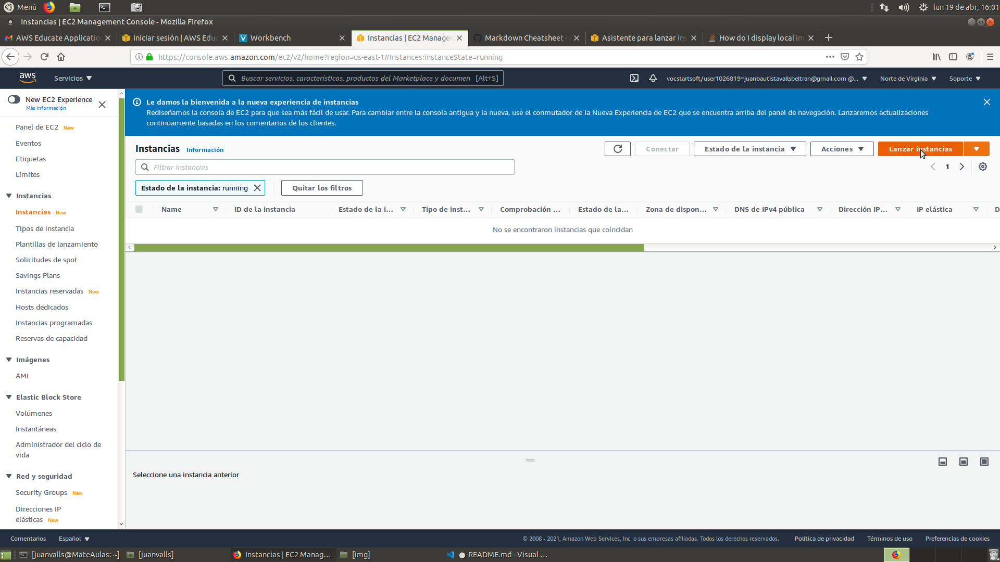

Pulsaremos en el botón "Lanzar Instancia" y esto dará comienzo al proceso de configuración de nuestra instancia. 

Lo primero que haremos es acceder a un menú en el que seleccionaremos la distribución en la que queramos lanzar nuestra instancia.

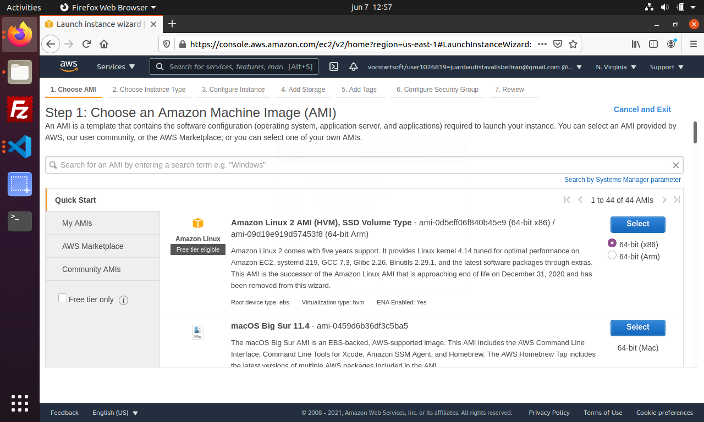

En nuestro caso es "Amazon Linux 2" así que esa será la que seleccionaremos. 

En este caso no queremos configurar nada excepto algunas reglas de entrada.

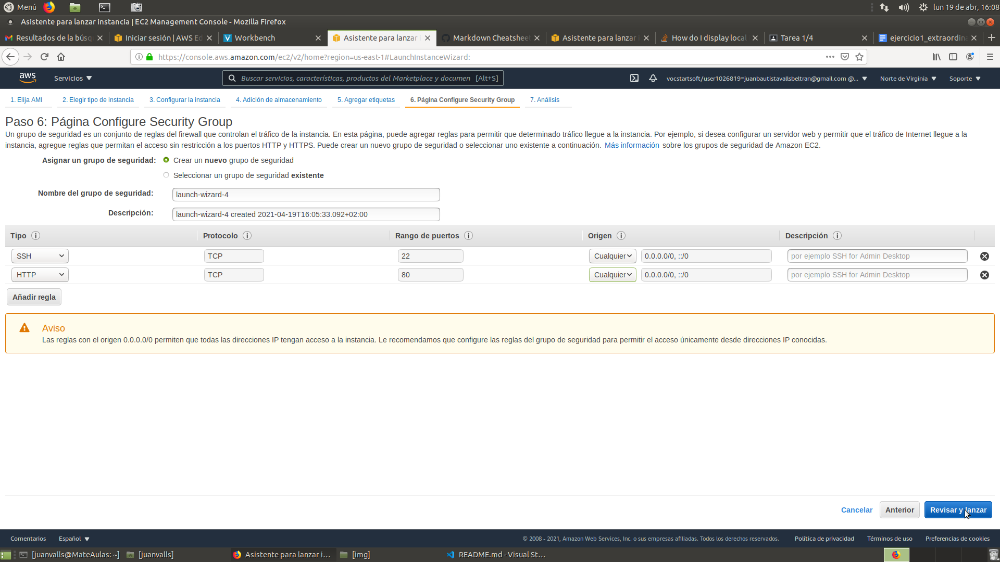

Como se puede observar hemos configurado dos reglas, una en SSH para poder acceder desde cualquier lugar y otra HTTP para poder acceder desde el puerto 80.

Seguiremos aceptando hasta que lleguemos al final del proceso de configuración, momento en el cual se nos pedirá que utilicemos unas claves para poder lanzar la instancia, en el caso de que las tengamos utilizaremos esas (si lo deseamos), en caso de que no las tengamos, deberemos crearlas.

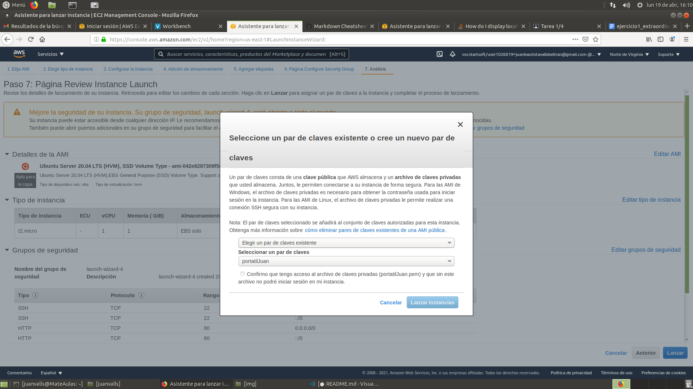

Seleccionareoms en el menú desplegable la opción "Crear nuevo par de claves" y les pondremos un nombre. A continuación nos las descargaremos.

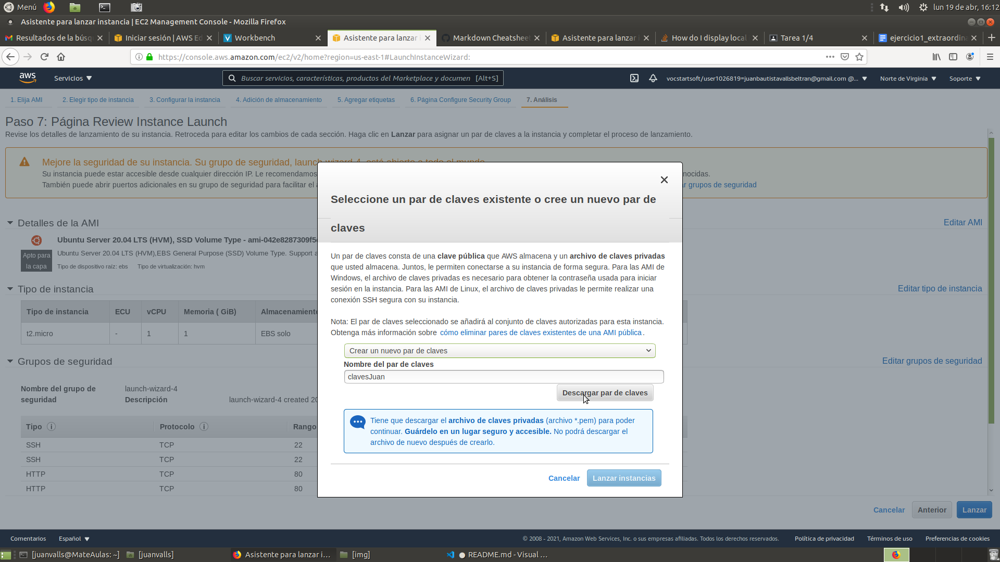

Después de haberlas creado y descargado, seleccionaremos la opcion en el desplegable que nos permita utilizar un par de claves ya existentes y las utilizaremos para lanzar la instancia. 

Si regresamos a nuestra página de instancias, deberíamos ver que ahora sí, tenemos una isntancia funcionando. 

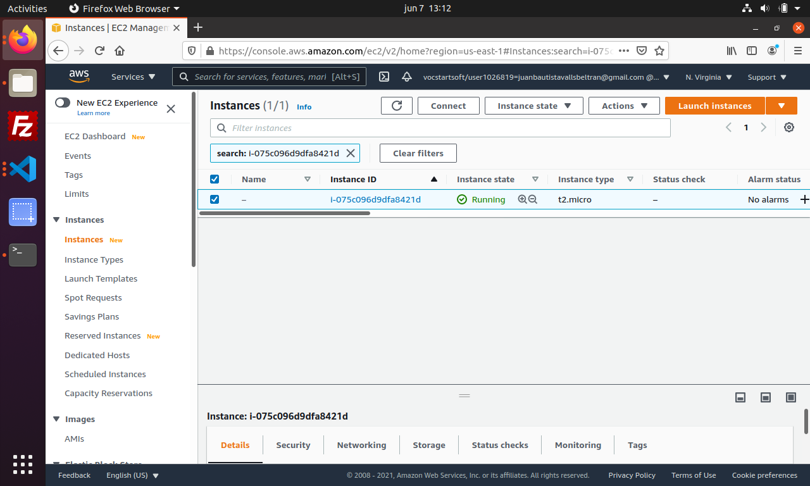
___
___

## Paso 2 - Conectarse a nuestra instancia desde la terminal, MATE o consola.
___
___
Lo primero que deberemos hacer para iniciar el proceso de instalación y configuración de aquellos servicios que necesitemos será conectarnos a nuestra instancia. 

Lo haremos desde la terminal (o consola).

Primero nos desplazaremos a la carpeta en la que tengamos nuestras claves con la siguiente instrucción:

```
cd miCarpeta
```

Para evitar potenciales problemas con los permisos deberemos otorgarnos todos con una instrucción:

```
sudo chmod 700 clavesJuan.pem
```

Cuando ejecutemos esta instrucción

Introduciremos lo siguiente:

```
ssh -i "clavesJuan.pem" ec2-user@54.242.19.233
```

En este caso en concreto, "clavesJuan.pem" se correspone al nombre de nuestro archivo de claves, y ec2-user@54.242.19.233 se corresponde en primer lugar al prefijo con el que debamos conectarnos a nuestra instancia (dependerá de la distribución que seleccionasemos al configurarla) y la IP es la que nos asigne Amazon.

En caso de que tengamos dudas de dónde encontrar esta información, podemos remitirnos a la imagen anterior y buscar la IP en el apartado "Dirección IP" en la barra horizontal.

Si la conexión ha salido bien debería aparecer en la consola algo parecido a lo siguiente:

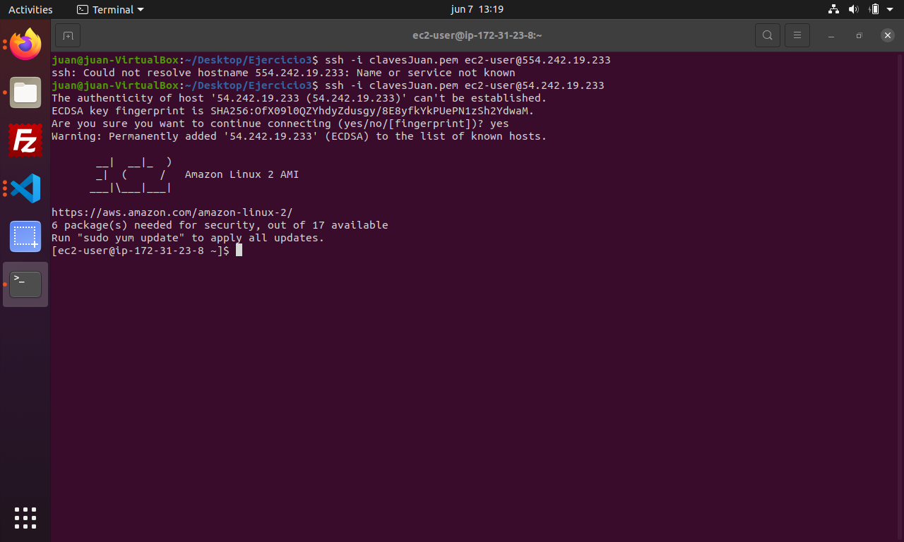

___
___

## Paso 3 - Instalar Apache2

Como nos sugiere la consola en la imagen anterior, ejecutaremos el proceso de actualización con la instrucción 

```
sudo yum update -y
```

y esperaremos hasta que el proceso se complete.

Después de este paso, instalaremos los repositorios para obtener las versiones más recientes de los paquetes LAMP de MariaDB y de PHP para amazon linux2. 

La instrucción será la siguiente:

```
sudo amazon-linux-extras install -y lamp-mariadb10.2-php7.2 php 7.2
```

Una vez se haya realizado este proceso, instalaremos PHP, MariaDB y Apache.

```
sudo yum install -y httpd mariadb-server
```

Si queremos comprobar la version de mariadb que hemos instalado podemos hacerlo con el siguiente comando:

```
yum info mariadb-sever
```

Para iniciar el servidor web Apache ejecutaremos el siguiente comando:

``` 
sudo systemctl start httpd
```

Después ejecutaremos el siguiente comando:

```
sudo systemctl enable httpd
```

Si queremos verificar que httpd está actuvo ejecutaremos el siguiente comando:

```
sudo systemctl is-enabled httpd
```

Si está activo la consola nos devolverá una palabra: "enabled".

Tras esto, añadiremos al usuario ec2-user al grupo apache, lo haremos con la siguiente instrucción:

```
sudo usermod -a -G apache ec2-user
```

Para que esto tenga efecto saldremos de la instacia introduciendo `exit` en la consola y volveremos a conectarnos.

Una vez volvamos a estar dentro de la instancia comprobaremos que efectivamente pertenecemos al grupo apache, lo haremos introduciendo `groups`.

Si todo ha ido correctamente deberíamos ver lo siguiente:

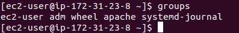

Para agregar permisos de escritura de grupo y establecer el ID de grupo en futuros subdirectorios, cambiaremos los permisos del directorio /var/www y sus subdirectorios con la instrucción:

```
sudo chmod 2775 /var/www && find /var/www -type d -exec sudo chmod 2775 {} \;

```

Después, introduciremos el siguiente comando para agregar los permisos de escritura de grupo del archivo /var/www y sus subdirectorios con el comando:

```
find /var/www -type f -exec sudo chmod 0664 {} \;
```
___

### Probar el servidor

Si queremos probar el servidor podemos crear un archivo de php en la raíz del documento apache, en este caso haremos la prueba con el documento de información de php.

```
echo "<?php phpinfo(); ?>" > /var/www/html/phpinfo.php
```

Para probar que esto haya funcionado iremos a nuestro navegador e introduciremos la dirección Public IPv4 DNS que encontraremos en nuestra página de instancias. En este caso en concreto sería la siguiente:

```
http://ec2-54-226-192-159.compute-1.amazonaws.com/phpinfo.php
```

Si hemos hecho lo anterior correctamente deberíamos ver algo parecido a esto:

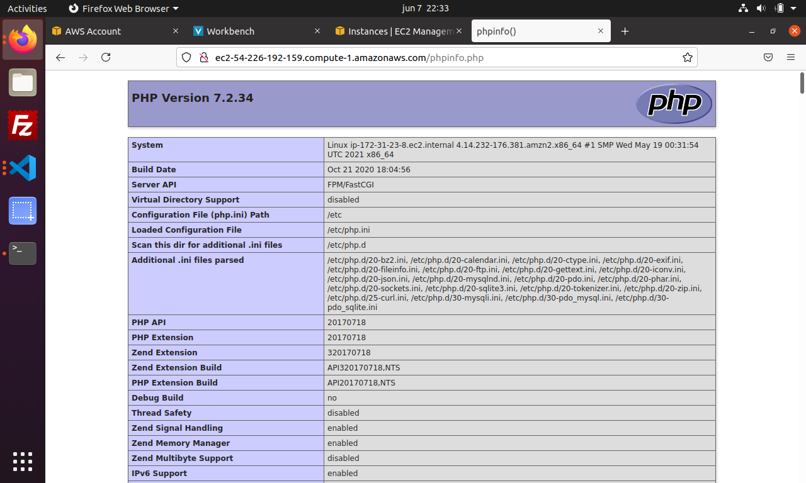


### Servidor LAMP

Deberemos iniciar el servidor mariadb con el comando:

```
sudo systemctl start mariadb
```

Tras esto, ejecutamos la instalación de sql:

```
sudo mysql_secure_installation
```

Durante el proceso de instalación deberemos seleccionar si o no en las opciones que nos dé, de acuerdo a nuestras necesidades.

También deberemos poner una contraseña para phpmyadmin, en nuestro caso será `test`, y el usuario será `root`. 

Si queremos parar el servidor lo haremos con el comando:

```
sudo systemctl stop mariadb
```

y cuando queramos iniciarlo, lo haremos con el comando: 

```
sudo systemctl enable mariadb
```


sudo yum install php-mbstring php-xml -y

sudo systectl restart httpd

sudo systemctl restart php-fpm

cd /var/www/html

wget https://www.phpmadmin.net/downloads/phpMyAdmin-latest-all-languages.tar.gz

(tener cuidado con las mayúsculas)

mkdir phpmyadmin && tar -xvzf phpMyAdmin-latest-all-languages.tar.gz C phpMyAdmin --strip-components 1

rm phpMyAdmin-latest-all-languages.tar.gz

sudo systemctl restart httpd

