# Ejercicio 1


## Paso 1 - Configuración de una instancia en Ubuntu 20.04 en Amazon AWS
___
___

Lo primero que deberemos considerar es si tenemos una cuenta válida en Amazon AWS, en caso afirmativo, entraremos desde este enlace.

[AWS Educate Login](https://www.awseducate.com/login?startURL=%2FSiteLogin "AWS Educate Login")

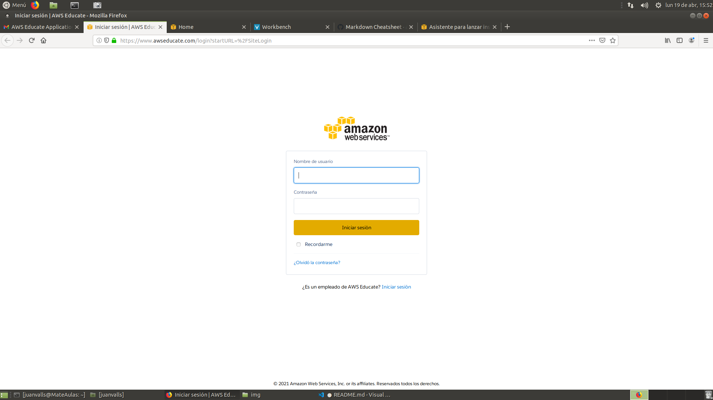

Introducimos nuestro usuario y contraseña y accedemos. 

Esto nos llevará a otra pantalla y deberemos acceder al apartado "AWS Account" ubicado en la barra horizontal del menú de navegación. 

Una vez accedamos aquí entraremos a la consola, y después al apartado "EC2". 

Deberíamos ver algo así.

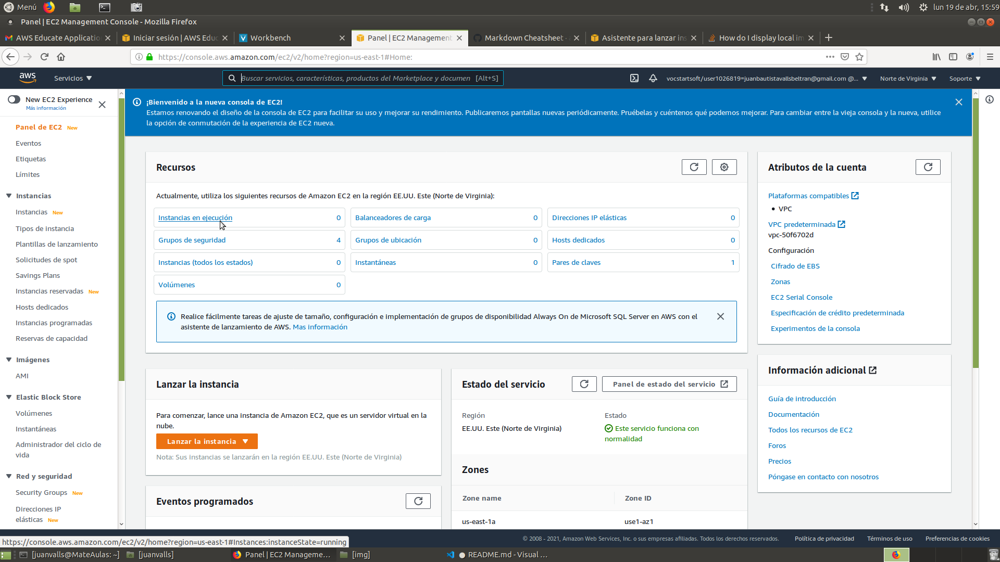

Por ahora no tenemos ninguna instacia en ejecución. 

Pulsamos en el apartado "Instancias en ejecución" para configuar la nuestra.

Nos llevará a la siguiente página

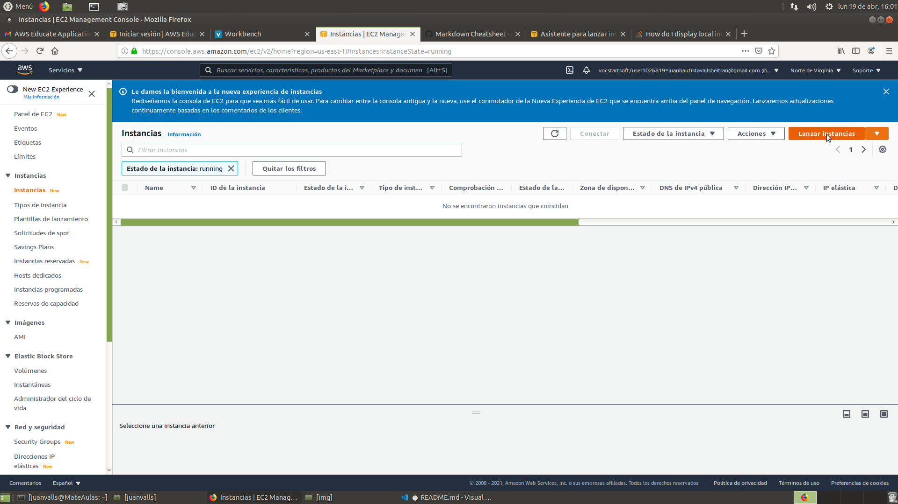

Pulsaremos en el botón "Lanzar Instancia" y esto dará comienzo al proceso de configuración de nuestra instancia. 

Lo primero que haremos es acceder a un menú en el que seleccionaremos la distribución en la que queramos lanzar nuestra instancia.

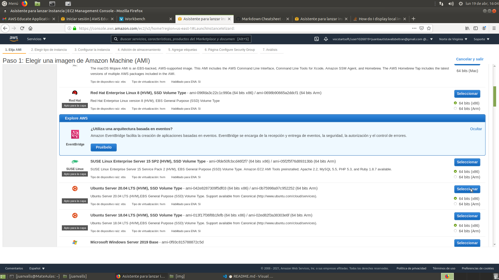

En nuestro caso es "Ubuntu 20.04" así que esa será la que seleccionaremos. 

En este caso no queremos configurar nada excepto algunas reglas de entrada.

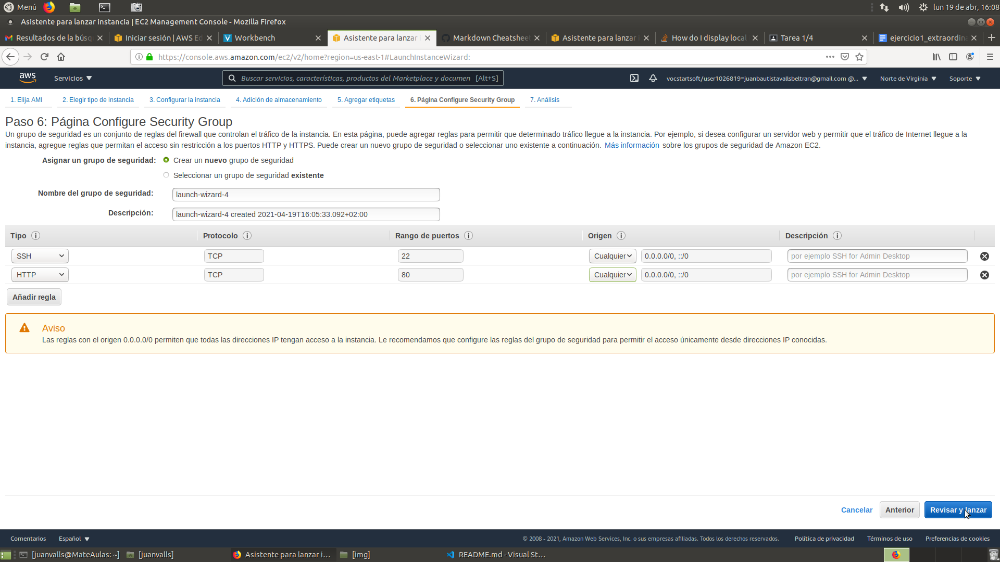

Como se puede observar hemos configurado dos reglas, una en SSH para poder acceder desde cualquier lugar y otra HTTP para poder acceder desde el puerto 80.

Seguiremos aceptando hasta que lleguemos al final del proceso de configuración, momento en el cual se nos pedirá que utilicemos unas claves para poder lanzar la instancia, en el caso de que las tengamos utilizaremos esas (si lo deseamos), en caso de que no las tengamos, deberemos crearlas.

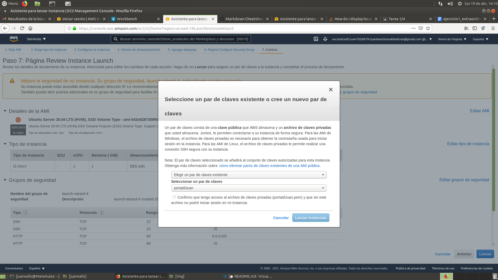

Seleccionareoms en el menú desplegable la opción "Crear nuevo par de claves" y les pondremos un nombre. A continuación nos las descargaremos.

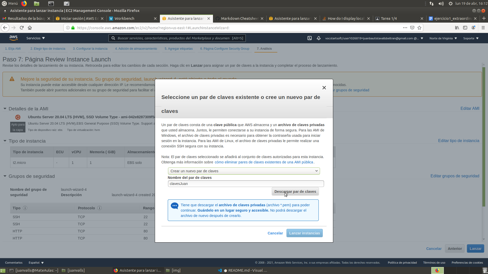

Después de haberlas creado y descargado, seleccionaremos la opcion en el desplegable que nos permita utilizar un par de claves ya existentes y las utilizaremos para lanzar la instancia. 

Si regresamos a nuestra página de instancias, deberíamos ver que ahora sí, tenemos una isntancia funcionando. 

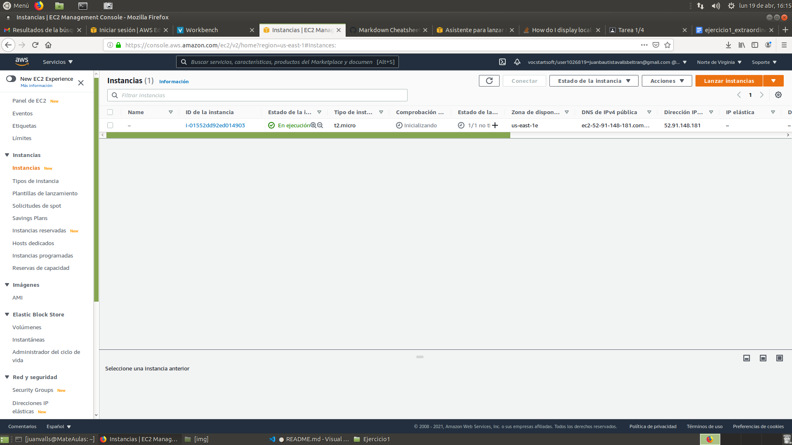
___
___

## Paso 2 - Conectarse a nuestra instancia desde la terminal, MATE o consola.
___
___

Lo primero que deberemos hacer para iniciar el proceso de instalación y configuración de aquellos servicios que necesitemos será conectarnos a nuestra instancia. 

Lo haremos desde la terminal (o consola).

Introduciremos lo siguiente:

```
ssh -i "clavesJuan.pem" ubuntu@52.91.148.181
```

En este caso en concreto, "clavesJuan.pem" se correspone al nombre de nuestro archivo de claves, y ubuntu@52.91.148.181 se corresponde en primer lugar al prefijo con el que debamos conectarnos a nuestra instancia (dependerá de la distribución que seleccionasemos al configurarla) y la IP es la que nos asigne Amazon.

En caso de que tengamos dudas de dónde encontrar esta información, podemos remitirnos a la imagen anterior y buscar la IP en el apartado "Dirección IP" en la barra horizontal.
___

### TroubleShooting

1. **En caso de que no tengamos las claves en el directorio raíz**

Haremos una de dos cosas, o accederemos a la carpeta en la que tengamos las claves

En este caso introduciendo lo siguiente en la consola

```
cd Escritorio
cd Ejercicio1
```

Lo haremos porque, de forma predeterminada, la consola de linux está en el directorio raíz. Si quisieramos hacerlo de forma que pudieramos exportar la instrucción a otros ordenadores, pondríamos la ruta de forma relativa:

```
"Escritorio/Ejercicio1/clavesJuan.pem"
```

2. **En caso de que nos enfrentemos al error "WARNING: UNPROTECTED KEY FILE"**

Si nuestro archivo de claves no tiene los permisos necesarios puede aparecernos este error. En este caso introduciremos lo siguiente en la consola para otorgarnos permisos:

```
chmod 700 clavesJuan.pem
```
___

Si todo ha salido bien, deberiamos ver algo así:

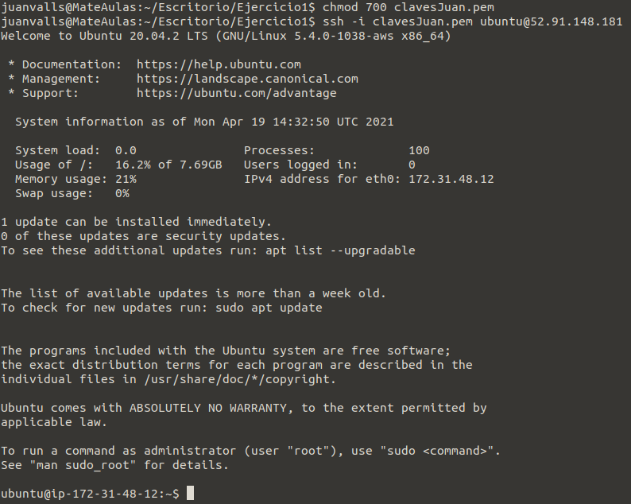

Ahora ya podríamos comenzar a instalar aquellos servicios que necesitemos. 
___
___

### Paso 3 - Instalando los servicios que necesitemos
___
___

#### Paso 3.1 Instalar APACHE

Deberemos instalar apache en nuestra instancia, lo haremos primero utilizando el comando update para asegurarnos de que todo va a estar actualizado.

```
sudo apt update
```

Esto iniciará el proceso de actualización, en caso de que pare y nos haga una pregunta, probablemente sea para solicitarnos más espacio en el disco duro, si queremos dárselo pondremos la letra "Y" y presionaremos la tecla "Enter".

Cuando acabe el proceso de actualización instalaremos apache, para hacerlo introduciremos lo siguiente en la consola:

```
sudo apt install apache2
```

Como en el caso anterior, esto iniciará el proceso de instalación de Apache.

Si queremos comprobar que lo que hemos hecho ha tenido efecto, podemos ir a nuestro navegador web e introducir nuestra IP pública, recordemos que es la que aparece listada en la página de instancias activas de Amazon AWS.

En la barra de búsqueda introduciríamos lo siguiente (en este caso en concreto):

```
http://52.91.148.181/
```

Si hemos hecho todo correctamente, deberíamos ver una página igual o parecida a la siguiente:

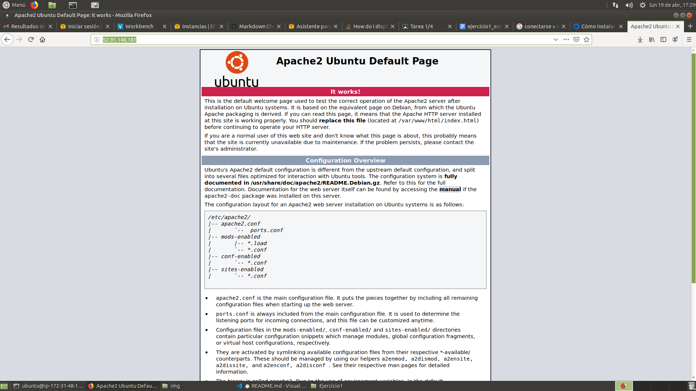


#### Paso 3.2 Instalar MySQL Server

Ya tenemos instalado un servidor Apache, ahora instalaremos un sistema gestor de base de datos, en este caso MYSQL Server.

Para hacerlo introduciremos la siguiente instrucción:

```
sudo apt install mysql-server
```

Esta instrucción iniciará el proceso de instalación de este servicio, como en el caso anterior, si necesita más espacio nos lo pedirá y le diremos que sí.

Para comprobar que podemos acceder escribiremos la siguiente instrucción en la consola:

```
sudo mysql
```

Debería ocurrir lo siguiente:

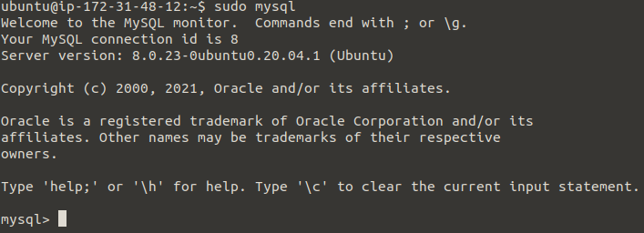

Si queremos salir, bastará con escribir la instrucción "exit" y presionar la tecla "enter".


#### Paso 3.3 Instalar PHP

Instalaremos PHP que será el procesador de código que utilizaremos para mostrar nuestro contenido.

El proceso es similar a los anteriores.

Introduciremos las siguientes instrucciones:

```
sudo apt install php libapache2-mod-php php-mysql
```

Si queremos saber la versión que hemos instalado introduciremos lo siguiente:

```
php -v
```

A efectos de aprendizaje lo haremos y deberíamos ver algo así:

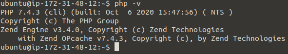


#### Paso 3.4 Instalar PHP My Admin

Como en los casos anteriores, introduciremos la siguiente instrucción en la consola:

```
sudo apt-get install phpmyadmin
```

Se iniciará el proceso de instalación que será un poco diferente a los anteriores.

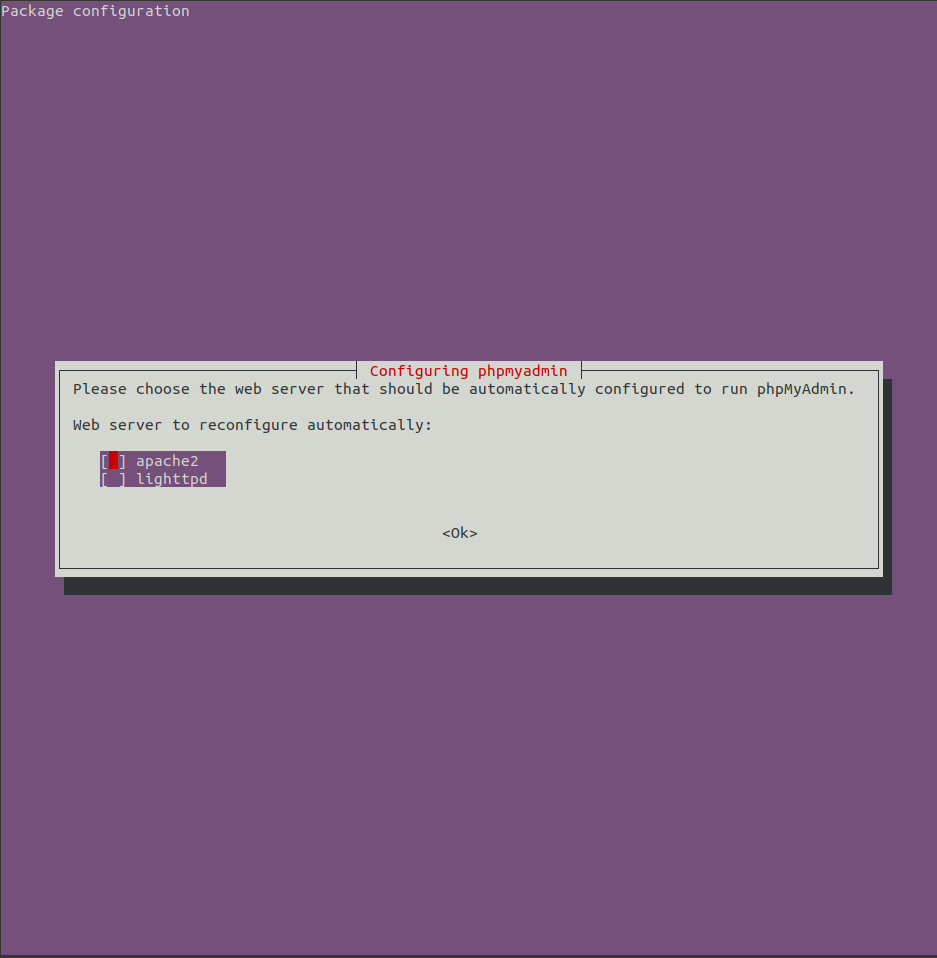

Para movernos por el menú utilizaremos las flechas y para fijar la opción seleccionada utilizaremos la barra de espacio, una vez seleccionemos nuestra opción, en este caso "apache2", presionaremos la tecla enter.

Una vez aceptemos saldrá esta pantalla:

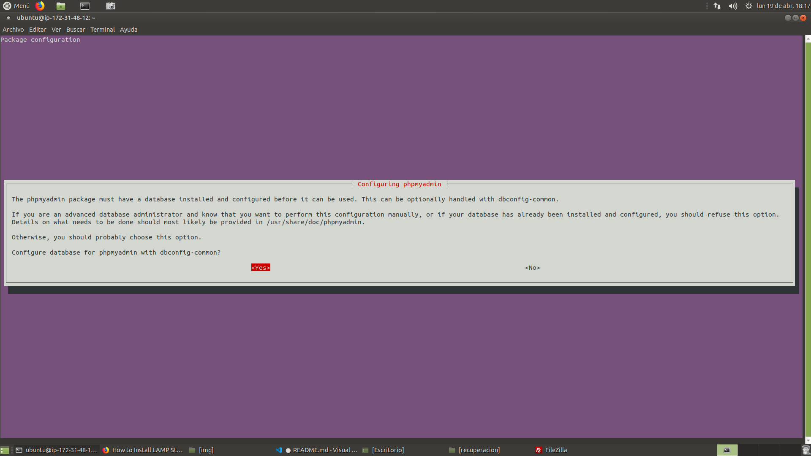

En nuestro caso aceptamos y saldrá la siguiente pantalla solicitando que introduzcamos una contraseña:

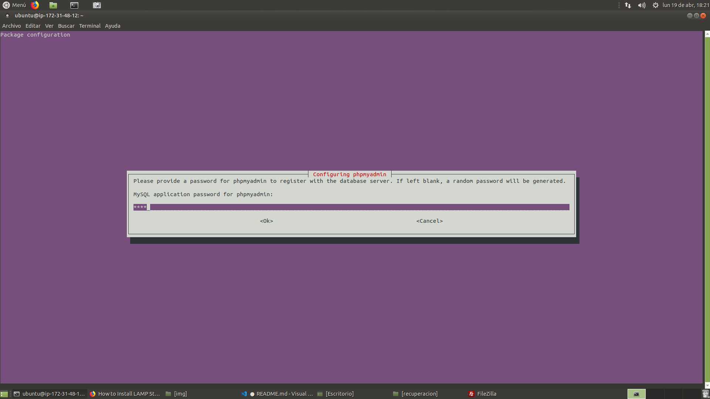

En nuestro caso la contraseña es "test".

Aceptamos, introducimos la confirmación de la contraseña y volvemos a aceptar, esto terminará de instalar PHPMYADMIN.

Si queremos probar que esto ha funcionado iremos a nuestro navegador web e introduciremos la DNS pública de nuestra instancia de Amazon AWS seguido de lo siguiente: "/phpmyadmin".

Es decir, en nuestro caso la búsqueda completa sería la siguiente:

```
ec2-52-91-148-181.compute-1.amazonaws.com/phpmyadmin
```

Esto nos llevará a la página home de phpmyadmin, recordemos que el usuario por defecto es "phpmyadmin" y la contraseña que hemos introducido es "test", y esto es lo que deberemos introducir para acceder

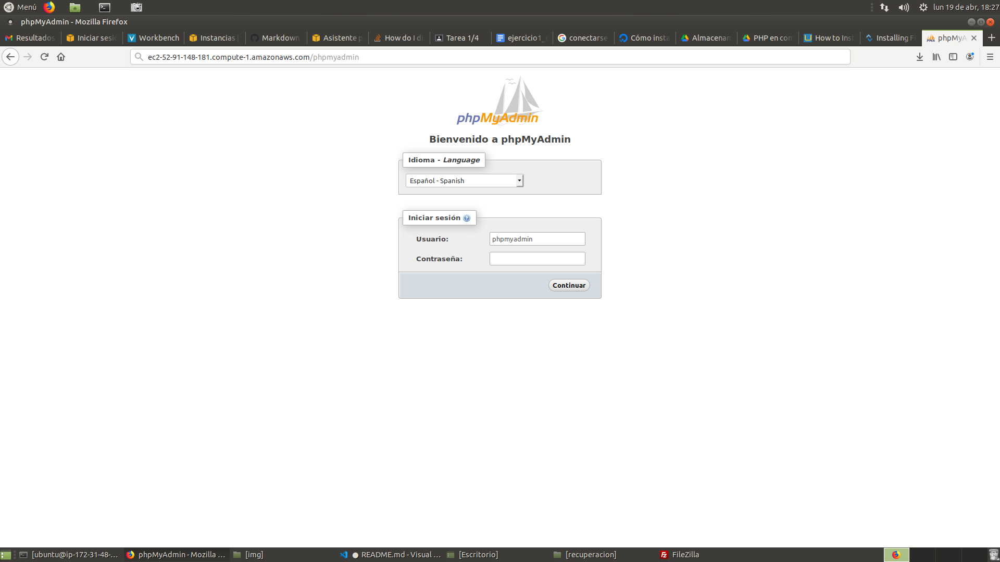

Con esto accederemos a la página principal de phpmyadmin, la siguiente:

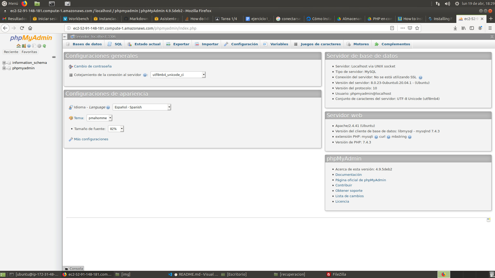

#### Paso 3.5 - Instalando Filezilla

Filezilla es un cliente FTP y es el que utilizaremos para conectarnos a nuestra instancia EC2. 

Si no tenemos filezilla en nuestra computadora, utilizaremos el siguiente comando (siempre que el sistema operativo sea Ubuntu) para instalarlo:

```
sudo apt-get install filezilla
```


### Paso 4 - Configurando Filezilla

Vamos a configurar Filezilla para conectarse a nuestra instancia. 

Abriremos filezilla, iremos a la pestaña "archivo > gestor de sitios" y deberíamos ver algo como lo siguiente, con algunas salvedades ya que los campos de texto estarán vacios:

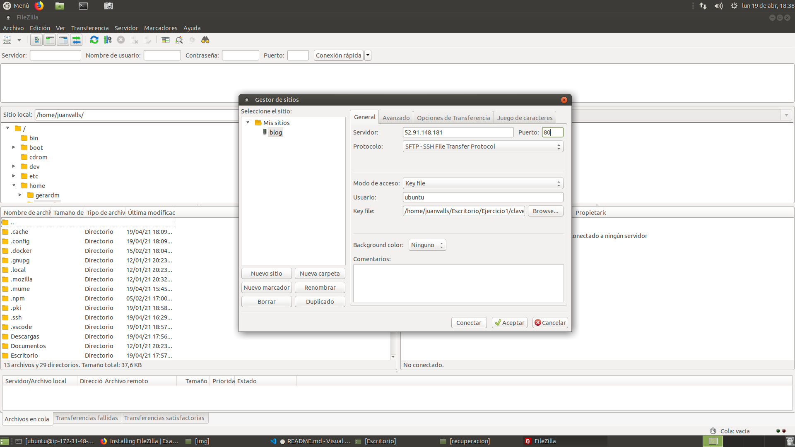

Dentro del apartado "Seleccionar el sitio" pulsaremos el boton "Nuevo sitio", en nuestro caso se llamará "blog". 

En el apartado "General", configuraremos el gestor de sitios tal y como aparece en la imagen, evidentemente deberemos poner en el apartado servidor la IP pública de nuestra instancia.

Asimismo, cambiaremos el procotolo a SFTP.

En el apartado método de acceso seleccionaremos KeyFile y le indicaremos la ruta para que pueda encontrar nuestras claves públicas de Amazon AWS.

Pulsaremos en el botón "Aceptar" y ya deberíamos tener configurado nuestra conexión a EC2 con Filezilla. 

Es cierto que nos saldrá una pantalla preguntándonos si confiamos en nuestro host, le diremos que sí.

Para subir los archivos al servidor pulsaremos en la carpeta en la que tengamos nuestra web con el botón derecho y seleccionaremos la opción "subir archivos", esto creará una carpeta igual en el sitio remoto. 

Deberíamos subir estos archivos a la carpeta "var/www/html" y darnos permisos con los siguientes comandos (que ejecutaremos dentro de la instancia EC2 en la consola):

```
sudo chown -R ubuntu /var/www/html
sudo chmod -R 755 /var/www/html
```
___
___
#### ACHTUNG PROBLEMAS

Aquí es donde empiezan los problemas.

Recuerda que a la hora de configurar el "nuevo sitio" en Filezilla hemos puesto protocolo sftp, tiene sentido porque necesitamos usar las claves públicas de Amazon.

Sin embargo, a la hora de intentar visualizar lo archivos en un navegador, nos dice que no soporta este protocolo, lo he buscado y chrome tampoco lo soporta, parece ser que es una decisión que tomaron conscientemente.
Sé que funciona porque lo hicimos en clase a principio de curso y pudimos ver la web de Paco.

Te adjunto un pantallazo de lo que quiero decir. 

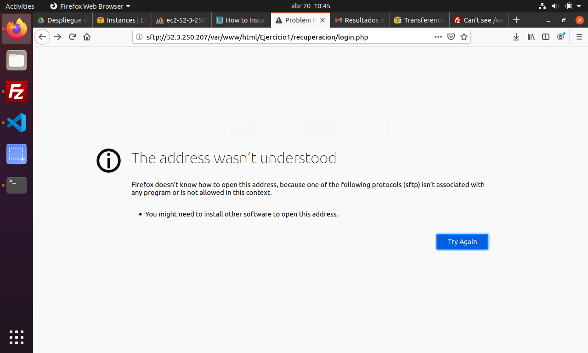

Me he dado permiso sobre las carpetas del directorio var/www/html con los comandos:

```
sudo chown -R ubuntu /var/www/html
sudo chmod -R 755 /var/www/html
```

Pero ese no parece ser el problema.

Como te digo en el correo, he llegado hasta aquí, supongo que una vez consiga superar esto, tendré otros muchos problemas nuevos, pero esos ya llegarán.

___


